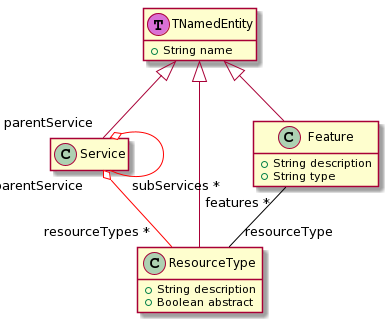
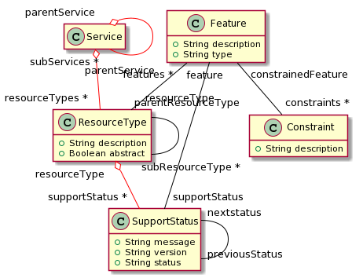
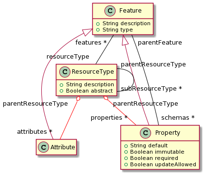
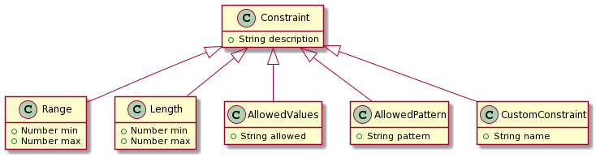

# OpenStackInMoose
Experiment to handle OpenStack description in Moose

## Example

One can create a small, example model with: ```OSAbstractTest new createExampleModel.```

## UML

The manually created metamodel is the following (created with plantUML):


The implemented metamodel is the following (there are a few slight differences).
Because they are generated from the actual metamodel, placing is not ideal, therefore the whole metamodel has been devided in parts. some central entites (e.g. ```Feature```) appear in several of these parts.

The top, named, entities of the metamodel:



Core part of the metamodel



Detailed view of the ```Feature```s, i.e. ```Attribute``` and ```Propertie``` : 



And, finally, detailed view of the ```Constraints```:


